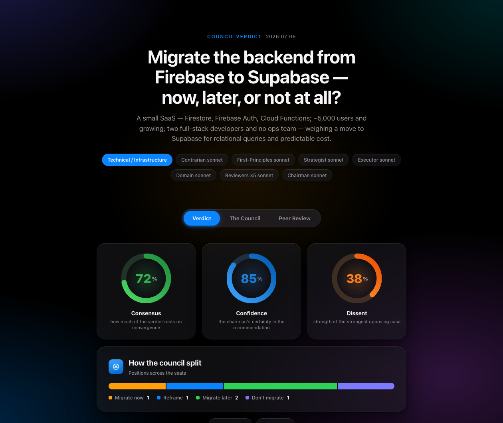
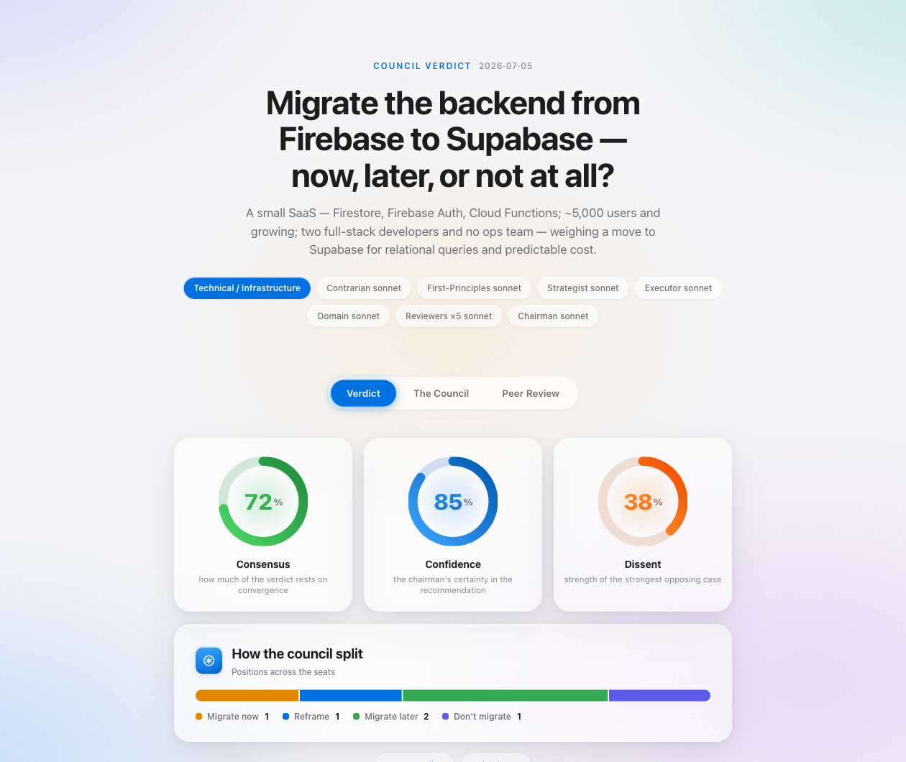
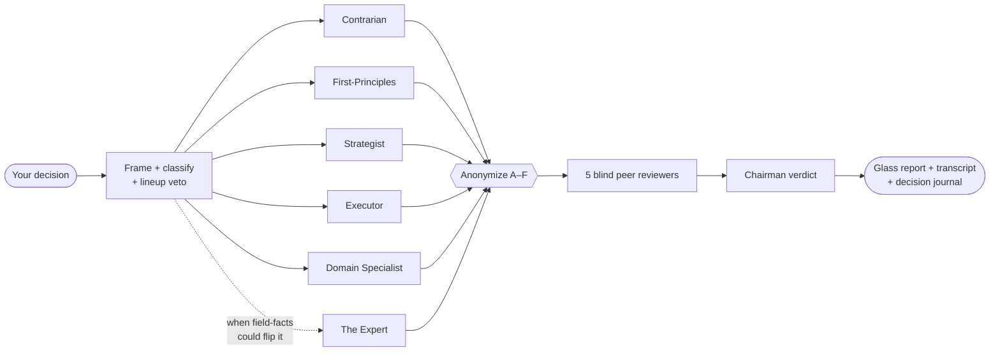

<div align="center">

# 🏛️ LLM Council

**Stop trusting Claude's first answer.**
Run any high-stakes decision through 5 AI advisors who argue, peer-review each other **blind**, and hand you a verdict with a named dissent — entirely on your Claude subscription.

[](LICENSE)
[](https://claude.com/claude-code)
[](#design-decisions-and-why)
[](#caveats--the-honest-list)

<table><tr>
<td width="50%"></td>
<td width="50%"></td>
</tr></table>

*Real output from a real run — nothing staged. Full run in [`examples/`](examples/).*

</div>

---

**Why a council?** A single answer mirrors your framing — ask *"should I launch this?"* and you get reasons yes; ask *"is this a bad idea?"* and you get reasons no. The council forces five committed positions, reviews them **anonymized** so no voice can pull rank, and requires a chairman to name the disagreements instead of averaging them away. In the [sample run](examples/), the boldest advice ("quit your job now — the window is closing") was flagged **5/5 in blind review** as the weakest reasoning in the room. That correction is the product.

Based on [Andrej Karpathy's LLM Council](https://github.com/karpathy/llm-council); reworked from the community skill by [@tenfoldmarc](https://github.com/tenfoldmarc/llm-council-skill).

## 60-second start

```bash
git clone https://github.com/lordalex/llm-council-skill
cd llm-council-skill
mkdir -p ~/.claude/skills/llm-council
cp SKILL.md report-template.html journal-template.html council.config.json ~/.claude/skills/llm-council/
```

Restart Claude Code, then bring it a real decision:

```
council this: should I quit my stable job to go all-in on my side project
($2k/month and growing), negotiate part-time, or keep grinding nights?
```

Also triggers: `run the council` · `pressure-test this` · `stress-test this` · `war room this` · `debate this` · `council revisit` · `council journal`.

## What happens when you run it



1. **Frame** — your question + safe workspace context (`CLAUDE.md`, `memory/`; never `.env`/keys) becomes one neutral brief. You see the model lineup **before anything spends usage**.
2. **Convene** — five thinking lenses respond in parallel, each committed to its angle. The panel adapts: technical decisions seat a *Reliability & Security* specialist; product ones a *Market & Outsider*; personal ones *Opportunity-Cost & Values*.
3. **Blind review** — responses are anonymized and cross-examined by five reviewers. Nobody can defer to a title.
4. **Verdict** — the chairman names where the council agrees, where it clashes, what everyone missed, one recommendation, one first step — and may side with a well-argued minority.

**You get:** an interactive glass report (opens automatically) · a full markdown transcript · a journal entry. ~2–4 minutes, 11–13 sub-agent calls on your plan.

## The feature tour

### 🎛️ You pick every seat's model
Three levels, highest wins: **inline** (`council this, chairman on opus, reviewers on haiku: …`) → **project** `council.config.json` → **global** `~/.claude/skills/llm-council/council.config.json`. Valid: `opus` · `sonnet` · `haiku` · `fable` · `default`. Shortcuts: `run it all on opus` / `keep it light` / `fastest`. The lineup echo shows the resolved seats before any spend — veto anytime.

Session model and council models are independent layers: run your chat on Opus while the 11 council calls run on Sonnet. The skill never routes to an external LLM API — every seat is Claude, on your subscription.

<details><summary><b>Full config schema</b></summary>

```json
{
  "models": {
    "contrarian": "opus",
    "first_principles": "opus",
    "strategist": "sonnet",
    "executor": "sonnet",
    "domain_specialist": "opus",
    "reviewers": "sonnet",
    "chairman": "opus",
    "expert": "opus"
  },
  "expert": "auto",
  "expert_research": "off"
}
```
Every key optional; `reviewers` sets all five at once. Model names are aliases resolving to current versions; anything unavailable on your plan falls back to `default` and is noted in the report footer.
</details>

### 🔬 The Expert — a sixth chair, seated only when it matters
During framing the council asks itself: *does this verdict hinge on facts of a specialized field, or purely on judgment?* If facts could flip it, it **drafts a bespoke persona from your question** ("a Postgres RLS security engineer who has run three Firebase migrations") and seats it. The Expert enters peer review **blind** — it wins on merit, not title.

With `with research` (or `"expert_research": "on"`), The Expert alone may verify claims against real sources and must tag every claim `[verified: source]` or `[recalled]` — the chairman weights them differently and tells you which load-bearing facts are which. **Research is off by default**: it's the one thing that would send data (search-query text) off your machine, so it never turns on silently. Controls: `with expert` · `no expert` · `with research` · config `"expert": auto|always|never`.

### 💬 Interactive by default — it's a session, not a vending machine
Three light checkpoints (say `quick` to skip all):
1. **Lineup veto** — seats, models, Expert persona, research state, before spend.
2. **Cross-examination** — interrogate any advisor after Stage 1; your question goes to *that same sub-agent with full context*, and its defense enters the peer review.
3. **Your lean** — state your position before the verdict; the chairman must engage it head-on — what you're underweighting if it agrees, the strongest reason you're wrong if it doesn't.

### 🛑 It knows what isn't its call
When a verdict hinges on legal / tax / medical / regulatory terrain — or on a human whose stake is material — it ends with **Consult Before Acting**: the *kind* of person to see and 2–3 verbatim questions to bring them. Rare by design; in the sample run it sent the user to their **partner** with three financial stress-test questions. And every single-source factual claim gets flagged *verify, don't trust*.

### 📊 The report
Fills the shipped [`report-template.html`](report-template.html) — deterministic design, zero improvisation, zero external assets, works offline forever. Frosted-glass cards over an ambient color field · three animated ring gauges (**Consensus / Confidence / Dissent**, derived honestly per run) · council-split bar chart · position spectrum · dot-matrix blind-vote tally · iOS-style gradient icon tiles · segmented-control tabs (keys `1`–`3`) · true-black automatic dark mode · print/PDF · copy-verdict. *(Preview: open [`examples/quit-job-for-side-project.report.html`](examples/quit-job-for-side-project.report.html) in a browser.)*

### 📓 The decision journal — does your council have a track record?
Every run logs to `council-journal.json` and renders `council-journal.html`: every council, its verdict, its gauges, its links. Then the accountability loop:

```
council revisit: the quit-my-job decision
```

You say what actually happened; one sub-agent scores the original recommendation **hit / miss / mixed**, names which advisor's position aged best, and extracts one transferable lesson. The journal tracks the hit rate. After ten decisions you know something nobody else can tell you: *whether your council is actually right, and which lens to trust on which kind of call.* A council that can't admit misses is a horoscope — this one keeps score.

## Cookbook — every pattern

```text
# ── the basics ─────────────────────────────────────────────
council this: <decision with real stakes and context>
pressure-test this: my plan is to launch the beta to the waitlist next Friday.
war room this: keep the agency client or go all-in on the product?

# ── speed & cost dials ─────────────────────────────────────
council this, quick: <decision>                    # skip all checkpoints
council this, keep it light: <decision>            # every seat on sonnet
council this, run it all on opus: <decision>       # maximum depth
council this, fastest: <decision>                  # every seat on haiku

# ── per-seat model control ─────────────────────────────────
council this, chairman on opus, everyone else sonnet: <decision>
council this, contrarian and domain specialist on opus, reviewers on haiku: <decision>

# ── the Expert seat ────────────────────────────────────────
council this, with expert: <niche-domain decision>
council this, no expert: <pure judgment call>
council this, with research: <fact-sensitive decision>   # ⚠ queries leave the machine

# ── combos that earn their keep ────────────────────────────
council this, quick, all sonnet, no expert: <cheap second opinion>
council this, with research, chairman on opus: <highest-stakes technical call>

# ── the track record ───────────────────────────────────────
council revisit: <a past decision>                 # score the verdict vs reality
council journal                                    # open the dashboard
```

**Per-project standing config:** drop a `council.config.json` next to the code — e.g. `{ "models": { "reviewers": "haiku" }, "expert": "always" }`. **Re-councilling:** ask again after acting; the skill reads prior transcripts and won't re-tread settled ground.

## Where to run it

| Surface | Verdict | Why |
|---|---|---|
| **Claude Code** (CLI / IDE) | ✅ full | Decisions *about a codebase you're in* — the context scan reads the real repo. |
| **Claude Cowork** | ✅ full | Best default for everything else — strategy, pricing, personal calls; pulls your `memory/`, previews the report inline. |
| **Claude.ai chat** | ⚠️ avoid | No true parallel sub-agents — degrades to one voice doing five impressions, which defeats the blind review entirely. |

One install serves Code and Cowork. **Good councils:** pricing, positioning, architecture, migrations, pivots, "which of these N", "am I crazy". **Skip it for:** factual lookups, pure creation ("write me a tweet"), summaries, validation-seeking.

## How it compares

| | [Karpathy's app](https://github.com/karpathy/llm-council) | [v1 skill](https://github.com/tenfoldmarc/llm-council-skill) | **this skill (v2)** |
|---|---|---|---|
| Diversity source | 4 vendors' models — true cross-model error-catching | one Claude, 5 personas | one Claude family: 5 lenses × per-seat models + optional research-verified Expert |
| Cost | OpenRouter credits, per token | subscription | subscription |
| Setup | Python+uv, Node+npm, API key, prepaid credits | drop 1 file | copy 4 files |
| Model control | edit `config.py` | none | 3-level per-seat + lineup veto before spend |
| Advisor panel | whatever you list | fixed, marketing-flavored | 4 lenses + domain-adaptive seat + conditional Expert |
| Fact-checking | strong — vendors disagree | weak | weak by default; **strong opt-in** — `[verified]` vs `[recalled]` |
| Knows its limits | no | no | Consult Before Acting + single-source claim flags |
| Interactivity | web UI to browse stages | fire-and-forget | veto · cross-examination · your lean challenged |
| Track record | none | none | decision journal + revisit scoring (hit/miss/mixed) |
| Output | local web app | basic HTML | glass interactive briefing + transcript + journal |
| Privacy | query goes to 4 providers | local | local; one opt-in exception (Expert research), always visible |

**Be honest about the tradeoff:** Karpathy's original is genuinely better for fact-heavy questions — four different training sets catch hallucinations five Claude lenses can't. This one is better for judgment calls with real tradeoffs, zero marginal cost, workspace context, per-seat control, an interrogable session, and a track record.

## Caveats — the honest list

1. **Persona diversity ≠ model diversity.** All advisors are Claude; they can share a wrong assumption. Great at reasoning gaps, weak as a fact-checker — add `with research` when facts are load-bearing.
2. **A full run is real usage** — 11–13 sub-agent calls (~2–4 min) against your plan. Don't council trivia.
3. **Research mode is the one privacy exception** — off by default, never silent, `(research on)` always shown in the lineup first.
4. **The context scan reads your files** (locally) — `CLAUDE.md`, `memory/`, referenced files. It skips `.env`/keys/tokens by rule; still, keep truly sensitive notes out of scanned folders.
5. **A confident verdict can still be wrong.** The chairman flags uncorroborated claims but can't catch what all six voices believe incorrectly. High stakes → read the transcript, not just the verdict.
6. **The chairman may overrule the majority** when a dissenter argues best. Feature, not bug — but check its stated reasoning.
7. **Files are written to your workspace** and the report auto-opens. Add `council-*` patterns to `.gitignore` in repos where you run it (this repo ships them).
8. **Trigger phrases can misfire** in edge cases — say `council this:` explicitly when you definitely want one.

## Design decisions (and why)

| Decision | Choice | Why |
|---|---|---|
| Runtime | Subscription-only; never routes to external LLM APIs | Predictable cost was the whole point |
| Expert research | Off by default, opt-in | "Nothing leaves your machine" holds unless you trade it for verification |
| Expert seating | `auto` | Zero user burden; seated only when field-facts could flip the verdict |
| Human escalation | Included, rare by design | A council that always says "see a professional" trains you to ignore it |
| Name | Kept `llm-council` (`war-room` considered) | Karpathy made it searchable; honesty lives in the docs |
| Interactivity | Default on; `quick` opt-out | Interrogable by default, automatable on demand |
| Report | Shipped template, tokens filled per run | Deterministic quality beats per-run improvisation |
| Examples | Real runs, unedited | Judge actual output, not marketing |
| Deferred | "Include me" blind mode, rebuttal rounds | Good ideas awaiting a real need — PRs welcome |

## Repo map

| File | Role |
|---|---|
| [`SKILL.md`](SKILL.md) | The entire skill — orchestration, prompts, guardrails |
| [`report-template.html`](report-template.html) · [`journal-template.html`](journal-template.html) | Shipped report + journal designs (token-filled per run) |
| [`council.config.json`](council.config.json) | Your standing lineup + expert policy |
| [`examples/`](examples/) | A real, unedited run: transcript + report |
| [`scripts/check_contract.py`](scripts/check_contract.py) | Keeps templates ↔ SKILL.md token docs in sync — run before PRs |

## Credit

Methodology: [Andrej Karpathy](https://github.com/karpathy/llm-council). Original Claude Code adaptation: [@olelehmann](https://x.com/olelehmann) / [@tenfoldmarc](https://github.com/tenfoldmarc/llm-council-skill).
v2 rework — made with ♥ by **LordAlex Leon**.

MIT — do whatever you want with it.
